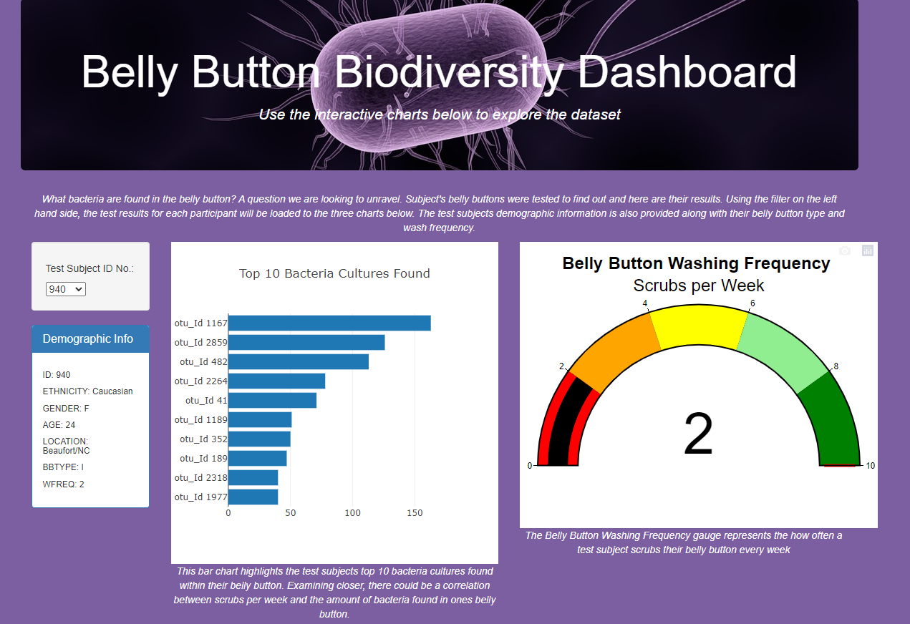
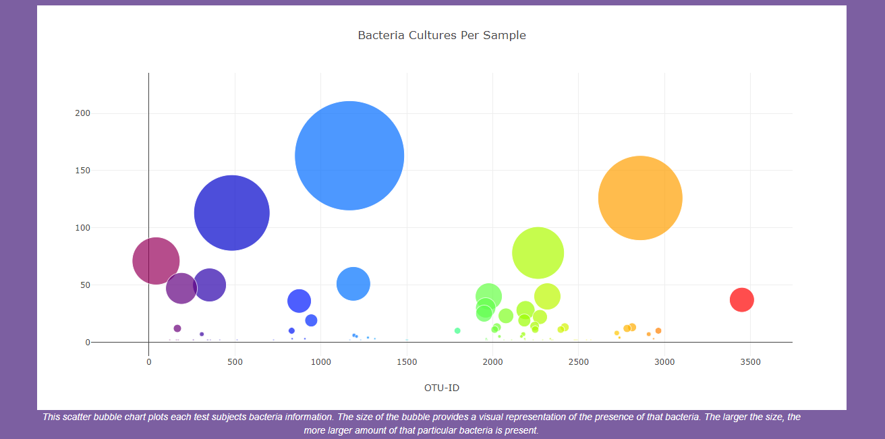

# Belly Button Diversity

Link to Dashboard: https://sengel23.github.io/bellybuttondiversity/

---

## Overview:

The purpose of this challenge was to create an interactive dashboard showcasing test subjects demographic information, belly button bacteria, and their belly button washing frequency. Using jumbotron, a bootstrap CDN to organize the page and javascripts d3.json function as a way to display chart visuals, the following page was created with a bar chart, gauge chart, as well as a bubble chart. The data provided in the charts is specific to each test subject ID number.

